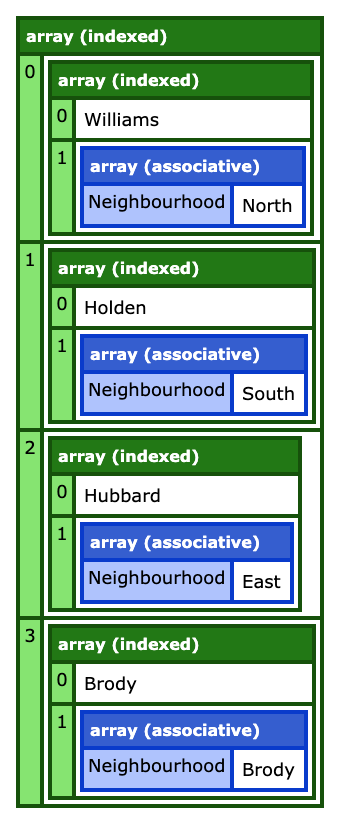
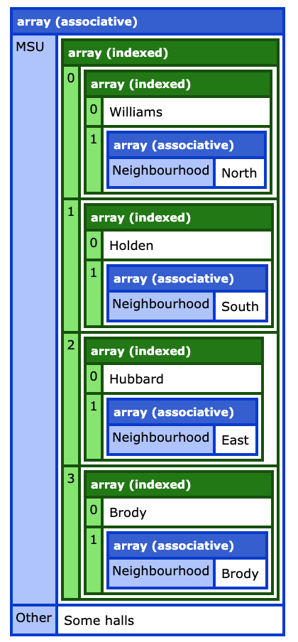

## Variables and Error Dumping with PHP

**function**: php_dump(_$variable_[, _$label_])

Being familiar with the _fancy_ dump coldfusion uses, I can hardly make sense of the raw dumping in php; I need something similar.

Currently done with dumping of indexed arrays, associative array.

The function _php_dump()_ accepts two arguments: **variable name** (required), and label (optional).

Check these outputs: 

