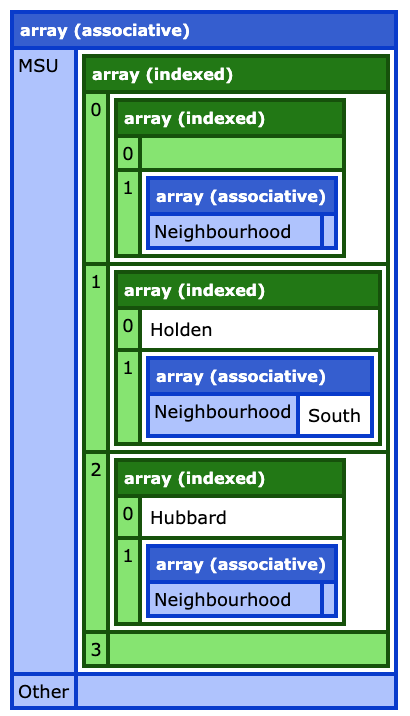

## Variable and Error Dumping with PHP

**function**: php_dump(_$variable_[, _$label_])

Being familiar with the _fancy_ dump Adobe Coldfusion uses, I can hardly make sense of the raw dumping in php; I need something similar.

#### Functionality (so far):
* Dumping
	* basic types (integer, boolean, float, _string_)
	* indexed arrays 
	* associative array
* Toggling display of values.  
	Click on the key of the value to toggle it's display.

#### The function **_php_dump()_** takes two parameters: 
1. **variable name** (required)
2. _label_ (optional)

#### Check these outputs:  
