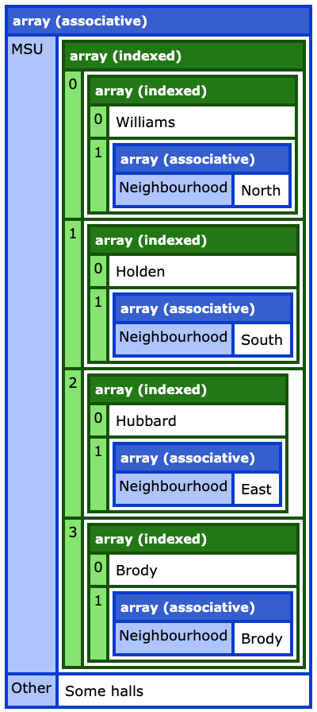
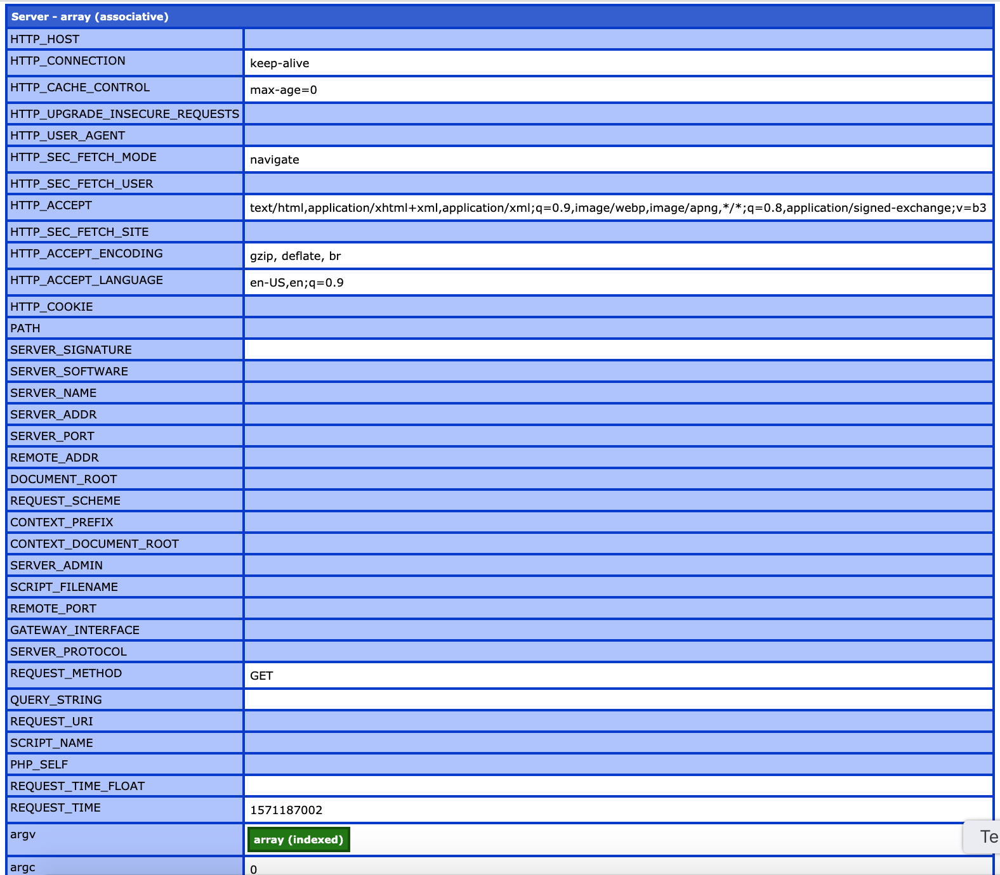

## Variable Dumping with PHP

####Usage: 
* composer require _**adudjandaniel/php_dump**_
* require_once _**/path/to/autoload.php**_ (Add to php scripts)
* use namespace _**PhpDump\Dump**_
* **Dump::php_dump(variable_name [, _label_])**

Being used to the _fancy_ dump Adobe Coldfusion uses, I can hardly make sense of the raw dumping in php; I need something similar.

#### Functionality (so far):
* Dumping
	* basic types (integer, boolean, float, _string_)
	* indexed arrays 
	* associative array
* Toggling display of values.  
	Click on the key of the value to toggle it's display.

#### The method **_php_dump()_** takes two parameters: 
1. **variable name** (required)
2. _label_ (optional)

#### Check these outputs:  
